# ⚡ VoltBio — Go-To-Market & Adoption Playbook

> *Dari repository kosong menuju 1.000+ GitHub Stars.*  
> *Dokumen strategi ini adalah peta jalan Anda untuk membawa VoltBio ke tangan ribuan pengguna.*

---

## 1. Unique Value Proposition (UVP)

### 🔴 Masalah yang Diabaikan Semua Orang

Linktree, Bento.me, dan sejenisnya menjual "kemudahan" — tapi dengan harga tersembunyi:

| Masalah | Linktree/Bento | VoltBio |
|---|---|---|
| **Privasi data** | Data pengunjung Anda ditracking oleh mereka | Zero tracking — data 100% milik Anda |
| **Branding paksa** | Logo "Linktree" di halaman Anda (kecuali bayar $5-24/bulan) | Tidak ada branding pihak ketiga, selamanya |
| **Vendor lock-in** | Halaman mati jika berhenti bayar | File HTML milik Anda sendiri, selamanya |
| **Kustomisasi terbatas** | Warna & font terbatas di free tier | 7 theme + custom colors + 4 button style, gratis |
| **SEO** | Paywall untuk meta tags & OG | SEO + Open Graph + Twitter Cards built-in, gratis |
| **Performa** | Bergantung pada server mereka | Static HTML = load < 100ms, zero downtime |

### 💜 The Killer Positioning Statement

> **"VoltBio: Your link page is a file you own, not a subscription you rent."**

Atau dalam Bahasa Indonesia:
> **"Halaman link Anda adalah file milik Anda, bukan langganan yang Anda sewa."**

### 🎯 Tiga Pilar Diferensiasi

```
1. PRIVACY-FIRST    → Zero database, zero tracking, zero accounts
2. TRULY FREE       → No paywall. No "upgrade to unlock". No catches.  
3. OWN YOUR DATA    → Download as HTML. Host anywhere. Works offline.
```

**Ini bukan sekadar "Linktree gratis."**  
Ini adalah **filosofi berbeda**: halaman link Anda seharusnya seperti file Word — Anda membuatnya, Anda menyimpannya, Anda meng-host-nya di mana pun Anda mau, dan tidak ada perusahaan yang bisa mencabutnya dari Anda.

---

## 2. Pemetaan Target Audiens

### 📊 Audience Matrix


---

### 🎯 Segment A: Developer & Tech Community (Launch Beachhead)

**Mengapa mereka?** Mereka yang pertama mencoba, pertama memberi ⭐, dan pertama menulis blog tentangnya.

| Persona | Pain Point | VoltBio Solution |
|---|---|---|
| **Junior Developer** | Butuh portfolio tapi belum bisa bikin sendiri | Visual editor, no-code, deploy 30 detik |
| **OSS Maintainer** | Butuh hub untuk semua project links | Self-hosted, custom domain, no dependencies |
| **Freelancer** | Linktree terlihat tidak profesional untuk client | Theme premium gratis, branding sendiri |
| **Bootcamp Graduate** | Perlu demonstrasi skill Next.js/React | Fork → customize → deploy = portfolio + learning |

**Messaging**: *"Stop paying $5/month for a page you can build in 30 seconds."*

---

### 🎯 Segment B: Kreator & Solopreneur

| Persona | Pain Point | VoltBio Solution |
|---|---|---|
| **Content Creator (100–10K followers)** | Linktree free tier terlalu basic, Pro terlalu mahal | All premium features, $0 forever |
| **Podcaster** | Butuh hub untuk Apple/Spotify/YouTube links | Auto-detect social icons, OG tags |
| **Newsletter Writer** | Ingin single page tanpa website builder | ZIP export, Vercel/Netlify, done |
| **Online Course Seller** | Perlu landing page ringan per kursus | Clone → edit → deploy per course |

**Messaging**: *"Every feature Linktree charges $24/month for. Free. Forever. No catch."*

---

### 🎯 Segment C: UMKM & Pelayanan Publik (Massive Untapped Market)

Inilah **blue ocean** yang belum disentuh oleh Linktree.

#### 🏪 UMKM Lokal (Warung, Toko Online, Catering)

**Problem**: Mereka butuh "website" tapi:
- Tidak punya budget untuk domain + hosting + developer
- Tidak mengerti WordPress/Wix
- Sudah "cukup" dengan WhatsApp, tapi susah share banyak link sekaligus

**Solution**: VoltBio sebagai **"Kartu Nama Digital"**
- Dibantu setup 1 kali oleh anak/keponakan yang tech-savvy
- Export sebagai file statis, hosting gratis di GitHub Pages
- Link ke: WhatsApp order, Gojek/Grab merchant, Instagram, Maps lokasi toko
- **Biaya: Rp 0. Selamanya.**

**Use-case copy**:
> *"Pak Budi punya warung nasi padang. Dulu customer bingung mau order ke mana. Sekarang satu link aja: menu PDF, order WhatsApp, lokasi Google Maps, review Google. Gratis. Tanpa langganan."*

#### 🏥 Bidan/Klinik Mandiri / Praktik Dokter

**Problem**: 
- Wajib punya informasi publik (jam praktek, alamat, nomor darurat)
- Tidak punya budget IT, tidak perlu website lengkap
- Pasien sering tanya hal yang sama berulang kali

**Solution**: VoltBio sebagai **"Papan Informasi Digital"**
- Link ke: Jadwal praktek, daftar layanan, nomor darurat, Maps, form pendaftaran
- Bisa diprint sebagai QR code di meja resepsionis
- **Tidak ada data pasien yang tersimpan di server manapun** (privacy compliance)

#### 🏛️ Instansi Pelayanan Publik / Perusahaan Utilitas Daerah

**Problem**:
- Website dinas sering lambat, rumit, dan outdated
- Masyarakat perlu akses cepat ke: nomor pengaduan, formulir, jadwal, tarif
- Budget IT terbatas, update website butuh approval berbelit

**Solution**: VoltBio sebagai **"Portal Informasi Satu Pintu"**
- Link ke: Pengaduan, cek tagihan, info tarif, jadwal pemadaman, kontak darurat
- Static = loading instant, tidak butuh server mahal
- Bisa di-embed sebagai QR code di tagihan/surat resmi
- **Contoh nyata**: PLN Batam bisa punya satu halaman dengan link ke cek tagihan, lapor gangguan, info tarif, dan customer service WhatsApp

**Messaging untuk sektor ini**:
> *"Satu halaman. Semua informasi. Tanpa server. Tanpa biaya bulanan. Tanpa IT department."*

#### 📋 Event Organizers / Komunitas

- Link ke: Form registrasi, jadwal acara, Maps venue, sponsors, social media
- Buat baru untuk setiap event, lalu archive — tidak perlu bayar subscription per-bulan
- **Bonus**: QR code di poster fisik → langsung ke halaman info event

---

## 3. Strategi Peluncuran: The 100-Star Sprint

### 📅 Timeline: 14-Day Launch Sprint

```
DAY 0  ─── PREPARATION ────────────────────────────────────
       ├── Finalize README + Live Demo on GitHub Pages
       ├── Record 30-second demo GIF/video
       └── Prepare all copy (posts, descriptions)

DAY 1  ─── SOFT LAUNCH ────────────────────────────────────
       ├── Push to GitHub with clean commit history
       ├── Deploy live demo to GitHub Pages
       ├── Post on personal Twitter/X + LinkedIn
       └── Share in 2-3 close developer group chats

DAY 2  ─── DEVELOPER COMMUNITIES ──────────────────────────
       ├── Post to r/webdev (Reddit)
       ├── Post to r/nextjs (Reddit)
       ├── Post to r/SideProject (Reddit)
       └── Submit to Dev.to (full article)

DAY 3  ─── HACKER NEWS ────────────────────────────────────
       ├── Submit "Show HN: VoltBio – Link-in-bio that 
       │   generates a file you own, not a subscription"
       └── Be active in comments for 6+ hours

DAY 5  ─── PRODUCT HUNT ───────────────────────────────────
       ├── Launch on Product Hunt (schedule for Tuesday)
       ├── Prepare maker comment with story
       └── Rally supporters to upvote early

DAY 7  ─── CONTENT WAVE ───────────────────────────────────
       ├── Publish "Why I Built VoltBio" blog post
       ├── Create Twitter/X thread (technical breakdown)
       └── Share in Indonesian dev communities (WPU, 
           Dicoding Forum, Grup FB programmer Indonesia)

DAY 10 ─── INTERNATIONAL + NICHE ──────────────────────────
       ├── Post to Indie Hackers
       ├── Submit to awesome-nextjs list
       ├── Submit to awesome-selfhosted list
       └── Cross-post article to Hashnode, Medium

DAY 14 ─── EVALUATE & ITERATE ─────────────────────────────
       ├── Analyze: stars, forks, traffic, feedback
       ├── Prioritize feature requests from community
       └── Plan v1.1 based on real user feedback
```

---

### 🎯 Platform-Specific Tactics

#### Reddit (Highest ROI for OSS)

| Subreddit | Timing | Post Style |
|---|---|---|
| **r/webdev** (2.5M) | Selasa/Rabu, 14:00 UTC | "I built a free, no-backend alternative to Linktree" |
| **r/nextjs** (100K) | Rabu, 15:00 UTC | Technical deep-dive: "How I built X with Next.js 15 + Tailwind v4" |
| **r/SideProject** (200K) | Kamis, 13:00 UTC | Story-driven: "From idea to 4 routes in 48 hours" |
| **r/selfhosted** (400K) | Jumat, 14:00 UTC | Focus on: no database, static, privacy-first |

> **⚠️ Reddit Rules**: Jangan spam. Engage genuinely. Answer every comment. Never ask for upvotes.

#### Hacker News — "Show HN"

**Title formula**: `Show HN: [Product] – [Benefit that challenges convention]`

> **Show HN: VoltBio – Free link-in-bio that exports as a single HTML file**

**Maker comment** harus mencakup:
1. Motivasi personal (mengapa Anda membuatnya)
2. Stack teknis (Next.js 15, Zustand, Framer Motion)
3. Keputusan arsitektur kontroversial yang menarik diskusi ("Why no database?")
4. Live demo link + GitHub link

#### Product Hunt

- **Launch day**: Selasa atau Rabu (traffic tertinggi)
- **Tagline**: "Your link page is a file you own, not a subscription you rent"
- **First comment**: Story tentang frustrasi dengan Linktree pricing
- **Gallery**: 4-5 screenshot: editor, preview, theme switching, deploy modal, exported HTML

#### Dev.to Article

**Title**: *"I Built a Free Linktree Alternative with Next.js 15 — Here's What I Learned"*

**Structure**:
1. Hook: "Linktree charges $288/year for features that take 200 lines of code"
2. Demo GIF
3. Architecture decisions (why static, why no database)
4. Code snippets (the interesting parts: theme engine, ZIP export)
5. CTA: star + try live demo

---

### 🌟 Taktik Mendapatkan 100 Stars Pertama

| Taktik | Expected Stars | Effort |
|---|---|---|
| Personal network (DM 20 developer friends) | 15–20 ⭐ | Low |
| Reddit r/webdev post (if it gains traction) | 20–50 ⭐ | Medium |
| Hacker News Show HN (if front page) | 50–200 ⭐ | Medium |
| Dev.to article with demo | 10–30 ⭐ | Medium |
| Product Hunt launch | 20–60 ⭐ | High |
| Twitter/X thread goes viral | 10–100 ⭐ | Variable |
| Submit to awesome-* lists | 5–15 ⭐ | Low |

**Realistic target**: **100–150 stars in 14 days** jika 3-4 channels hit.

**Power move**: Respond to EVERY GitHub issue within 4 hours. First contributors should feel welcomed. This is how communities are built.

---

## 4. Draf Copywriting Peluncuran

### 🐦 Twitter/X Post (Viral-optimized)

```
I built a free alternative to Linktree.

No account. No database. No paywall. No tracking.

Here's what's different:

→ Visual editor with live preview
→ 7 premium themes (all free)
→ SEO + Open Graph built-in
→ Exports as a single HTML file you OWN
→ Deploy to Vercel/Netlify/GitHub Pages in 30 sec

Every feature Linktree charges $24/month for.
Free. Forever. Open source.

Built with Next.js 15, Tailwind v4, and Framer Motion.

⚡ Try it: [LIVE DEMO URL]
⭐ Star it: [GITHUB URL]

#opensource #webdev #nextjs #buildinpublic
```

---

### 💼 LinkedIn Post (Professional tone)

```
I just open-sourced VoltBio — a privacy-first 
link-in-bio builder.

Here's the thing about Linktree:

• Your data sits on their servers
• Their logo on YOUR page (unless you pay)
• $288/year for features that should be free
• Your page dies when you stop paying

VoltBio takes a different approach:

✅ 100% client-side — zero backend, zero database
✅ Export your page as a single HTML file
✅ Host it anywhere — Vercel, Netlify, GitHub Pages
✅ All themes, all features, forever free
✅ Your data never leaves your browser

Built with:
Next.js 15 · TypeScript · Tailwind CSS v4 · Framer Motion

It's MIT licensed and ready to use today.

🔗 Live Demo: [URL]
📦 GitHub: [URL]

If this is useful, a ⭐ on GitHub means the world.

#OpenSource #WebDev #NextJS #Privacy
```

---

### 🇮🇩 Post untuk Komunitas Indonesia

```
🚀 Baru saja rilis: VoltBio — pembuat halaman 
"link-in-bio" yang 100% GRATIS.

Kalau kamu pakai Linktree, kamu bayar Rp 380.000/bulan 
(Pro plan) untuk fitur yang seharusnya gratis:

❌ Custom theme → di VoltBio: GRATIS
❌ Remove branding → di VoltBio: GRATIS  
❌ SEO tags → di VoltBio: GRATIS
❌ Analytics → di VoltBio: GRATIS

Yang bikin beda:
→ Tanpa database. Tanpa server. Tanpa akun.
→ Export jadi 1 file HTML, hosting di mana aja
→ Data kamu 100% milik kamu, bukan perusahaan lain

Perfect buat:
• Developer yang butuh portfolio
• UMKM yang butuh "kartu nama digital"
• Kreator yang capek bayar subscription
• Siapa aja yang mau halaman link profesional, gratis

⚡ Coba langsung: [LIVE DEMO]
⭐ Kasih bintang: [GITHUB]

Dibuat pakai Next.js 15 + Tailwind CSS v4.
Open source, MIT License. Fork sesuka hati! 💜
```

---

## 5. Growth Flywheel: Setelah 100 Stars

```mermaid
graph LR
    A["🌟 GitHub Stars"] --> B["📈 Visibility<br/>(Trending, Search)"]
    B --> C["👥 New Users"]
    C --> D["🐛 Issues & PRs"]
    D --> E["✨ Better Product"]
    E --> F["📢 Word of Mouth"]
    F --> A
    
    style A fill:#8b5cf6,color:#fff
    style B fill:#6366f1,color:#fff
    style C fill:#3b82f6,color:#fff
    style D fill:#06b6d4,color:#fff
    style E fill:#10b981,color:#fff
    style F fill:#f59e0b,color:#fff
```



### Aksi Pasca-Launch untuk Sustainability

| Minggu | Aksi |
|---|---|
| **W3–4** | Ship 2 most-requested features dari community feedback |
| **W5–6** | Write "How VoltBio Works" technical blog series |
| **W7–8** | Add 3 new themes based on user requests |
| **W9–12** | Explore: custom domain support, analytics dashboard |
| **Monthly** | "Contributor of the Month" shoutout di README |

---

## 6. Metrics Dashboard — Apa yang Harus Diukur

| Metric | Target (30 hari) | Tool |
|---|---|---|
| GitHub Stars | 100–200 | GitHub |
| GitHub Forks | 15–30 | GitHub |
| Live Demo traffic | 500+ unique visitors | Umami/Plausible |
| Dev.to article views | 2,000+ | Dev.to analytics |
| Reddit upvotes (total) | 100+ | Reddit |
| Product Hunt upvotes | 50+ | Product Hunt |
| Contributors | 3–5 first-time contributors | GitHub |
| Issues filed | 10+ (sign of engagement) | GitHub |

---

## 7. Quick Wins — Eksekusi Hari Ini

### ✅ Checklist yang bisa Anda selesaikan HARI INI:

```
□ Deploy live demo ke GitHub Pages (push + enable Pages)
□ Record 30-detik screen recording (editor → preview → theme switch)
□ Convert recording ke GIF dan embed di README.md
□ Post pertama di Twitter/X (gunakan draf di atas)
□ Post di LinkedIn (gunakan draf di atas)
□ Share di 3 grup developer WhatsApp/Telegram terdekat
□ Submit ke r/SideProject (paling welcoming untuk launch)
□ Bookmark: schedule Dev.to article untuk besok
□ Bookmark: schedule Hacker News Show HN untuk lusa
```

---

<div align="center">

**VoltBio bukan cuma proyek kode.**  
**Ini adalah pernyataan bahwa tools dasar seharusnya gratis dan milik semua orang.**  

*Sekarang, bawa pesan ini ke dunia.* 🚀💜

</div>
